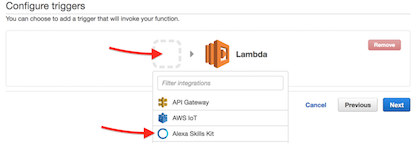

#### Tutorials
## 3. Create the Lambda Function <a id="title"></a>
<hr />

1. Login to AWS and verify the region at the top right is set to either **Ireland** or **N. Virginia** Region region.
1. Click [Lambda](https://console.aws.amazon.com/lambda/home) and then **Create a Lambda function**  Do not select the default **Blank** blueprint.
1. Locate and click on the ```alexa-skill-kit-sdk-factskill``` skill template (hint: search for **fact** )
1. Click in the empty square and choose the trigger *Alexa Skills Kit* and click Next.
  + 
1. Give your function the name *HelloWorld*
1. Select all the existing Javascript code and delete it.
1. Paste in the source code from [src/index.js](./src/index.js) :
    ```
        var Alexa = require('alexa-sdk');

        exports.handler = function(event, context, callback) {
            var alexa = Alexa.handler(event, context);
            alexa.registerHandlers(handlers);
            alexa.execute();
        };

        var handlers = {
            'LaunchRequest': function () {
                this.emit('MyIntent');
            },

            'MyIntent': function () {
                this.emit(':tell', 'Hello World from Alexa!');
            }
        };
    ```
1. Just below the code editor, create or re-use an execution role, such as ```lambda_basic_execution```
1. Click Next and create the function.
1. Press the blue TEST button to begin a unit test.  Choose the event template called Alexa Start Session.
1. Notice Lambda ARN, shown near the top right, such as
 *  ``` arn:aws:lambda:us-east-1:333304287777:function:HelloWorld ```


#### Continue to the next step


 * [Part 4 - Connect your skill to Lambda](./PAGE4.md#title)


<hr />
Back to the [Tutorials Home Page](../README.md#title)
